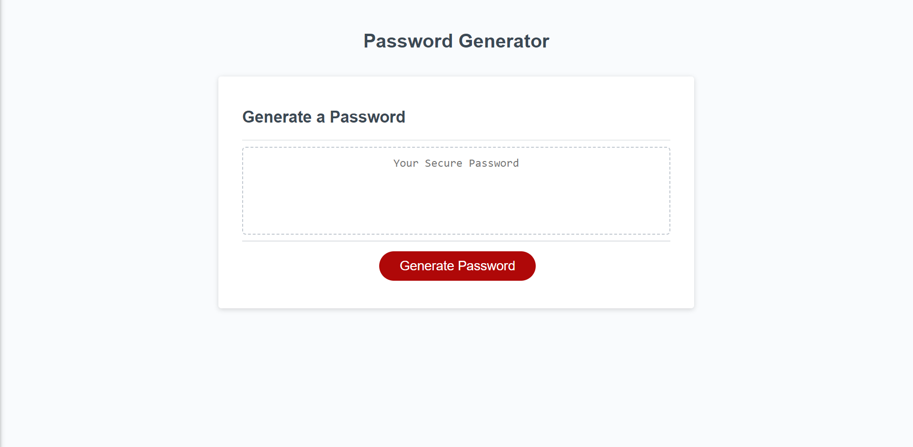

# Password Generator

## Description

This application can generate a random password 10 to 64 characters long and containing a combination of characters of the user's choice between lowercase letters, uppercase letters, numbers, and symbols.

## Instructions

 

 

When the "Generate Password" button is clicked, the user will be prompted with choices to generate their password.

This includes:
* The length of the password (10 - 64 characters)
* And the choice to include at least one of the following:
    * lowercase letters     `abcedfghijklmnopqrstuvwxyz`
    * uppercase letters     `ABCEFGHIJKLMNOPQRSTUVWXYZ`
    * numeric characters    `0123456789`
    * special characters    `@%+\\/'!#$^?:,)(}{][~-_.`

Once the password contents criteria have been selected, the password is automatically generated with random characters from the selection and displayed within the display box.

 

Click here to access the [**Password Generator**](https://c-navarroperez.github.io/PasswordNator/) 

## Contributing 
Please email me or report issues directly [here](https://github.com/c-navarroperez/PasswordNator/issues).

GitHub: [c-navarroperez](https://github.com/c-navarroperez)

Email address: carlosnavarro.brs@gmail.com

---

## License

Licensed under the [MIT](LICENSE) license.
